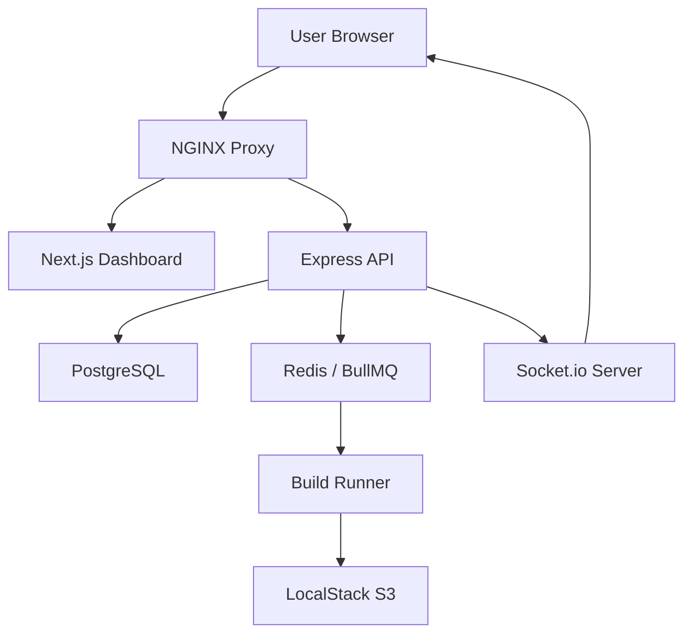

# DeployFlow

A production-grade Platform as a Service (PaaS) similar to Vercel and Render.

## Features

- **Automatic Deployments**: Git-push triggered builds via webhooks.
- **Build Engine**: BullMQ-powered concurrent build queues.
- **Real-time Logs**: Live build streaming via Socket.io.
- **Custom Domains**: Automated NGINX proxying for custom subdomains.
- **Environment Management**: Encrypted environment variables per project.
- **CLI Tool**: `deployflow` CLI for command-line management.
- **Managed Services**: Simulated database and serverless function provisioning.

## Tech Stack

- **Frontend**: Next.js 14, Tailwind CSS, shadcn/ui
- **Backend**: Node.js, Express, TypeScript
- **Database**: PostgreSQL (Prisma ORM)
- **Queue**: BullMQ + Redis
- **Storage**: AWS S3 (via LocalStack)
- **Proxy**: NGINX

## Getting Started

1. **Clone the repository**
2. **Setup environment variables**
   ```bash
   cp .env.example .env
   ```
3. **Start infrastructure**
   ```bash
   docker-compose up -d
   ```
4. **Install dependencies**
   ```bash
   npm install
   ```
5. **Initialize database**
   ```bash
   ./infra/scripts/setup-db.sh
   ```
6. **Run development servers**
   ```bash
   npm run dev
   ```

## Architecture



## CLI Usage

```bash
deployflow login
deployflow deploy --project <project-id>
deployflow logs <deployment-id>
```

## License

MIT
